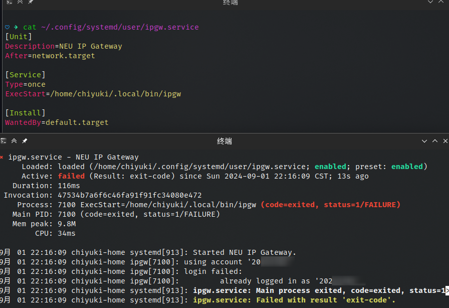
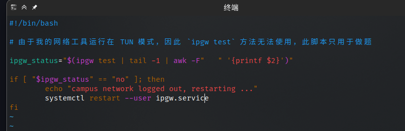

# Git 基础知识

**题目一**：部分网络环境下无法通过 ssh 进行 git 推送，因此我一直在使用 https。

**题目二**：无。

**题目三**：编辑主分支下的 Hello-dev.txt 以使其和 dev 分支产生合并冲突，之后使用 `git merge` 并且在文本编辑器中解决冲突即可。

**实现开机启动时自动登录校园网并且断连后自动重连**：经过搜索之后在众多项目中发现了维护相对比较新的 [ipgw](https://github.com/neucn/ipgw)，可以在比较现代的发行版上运行。「自动登录校园网」可以使用 systemd unit 或 XDG autostart 实现，「断连后自动重连」可以写个脚本跑 `ipgw test`，之后用 cron 定时运行即可。因为军训时脑子是一坨糨糊，因此暂时想不到更优雅的解决方案。🤔

截图

**使用 WebVPN 来访问校园内网的任意网址**：https://webvpn.neu.edu.cn 。

**题目四**：https://chiyuki0325.github.io/Hello-Git | https://pioneer-git.chyk.ink

